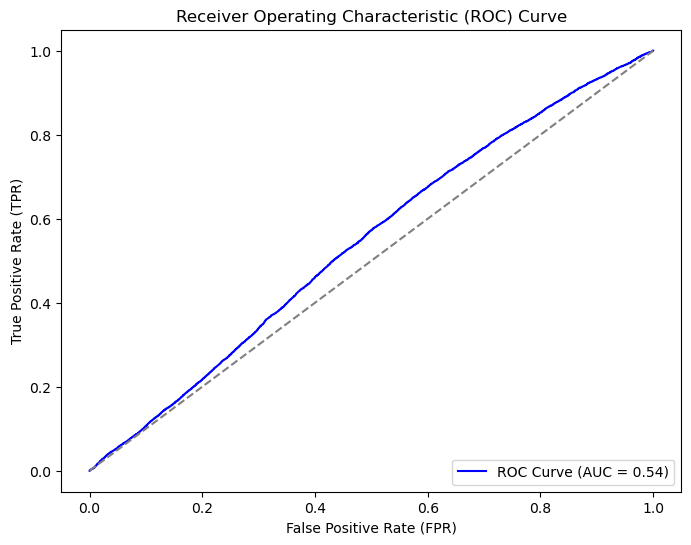

# Bitcoin Time Series Momentum Trading 

## Project Overview

The purpose of this project is to predict the direction of the momentum of the Bitcoin at a 5-min interval using features derived from OHLCV data. Then, we derive a trading strategy based on the output probabilities of an increase or a decrease in momentum and we backtets this strategy on out-of-sample data using an expanding window approach.

## Results

### LSTM

### XGBoost

